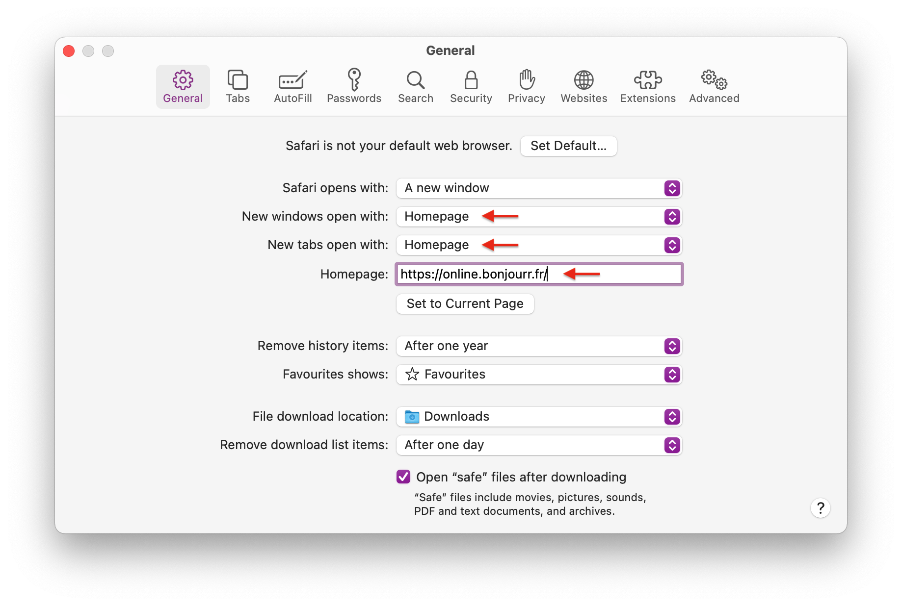

## 🖥️ As a desktop extension

-   [Chrome & Brave](https://chrome.google.com/webstore/detail/bonjourr-%C2%B7-minimalist-lig/dlnejlppicbjfcfcedcflplfjajinajd?hl=fr&authuser=0)
-   [Firefox](https://addons.mozilla.org/fr/firefox/addon/bonjourr-startpage/)
-   [Safari (soon™️)](#)
-   [Edge](https://microsoftedge.microsoft.com/addons/detail/bonjourr/dehmmlejmefjphdeoagelkpaoolicmid)

## 🌍 Using Online

-   As a mobile web app: In the browser menu, select 'Add to Home Screen' or 'Install'
-   For most browser, go to Settings => Homepage => Open this page => `https://online.bonjourr.fr`
-   For Safari desktop, while we work on the extension. Head to Safari's preferences (⌘ + comma) and set your homepage as `https://online.bonjourr.fr`. Set both new windows and new tabs to open with your homepage
    

Deleting your cache will also reset Bonjourr, so **consider keeping a copy of its settings somewhere in a notes app** (Show all settings → Export code).

<!-- Bonjourr is available on the  store.

Once you’ve installed Bonjourr, you’ll need to enable it for it to be active. Enter `edge://extensions` in your adress bar, locate Bonjourr and click on the switch.
If you’d like to help us financially, because we would still love to publish Bonjourr on Safari, you can [donate here](https://ko-fi.com/bonjourr).
Thanks to caching, Bonjourr will keep your settings and feel almost as fast as a local page.
Opera doesn't support Bonjourr.  _Extensions cannot replace Opera’s default start page_. According to [their acceptance criteria](https://dev.opera.com/extensions/acceptance-criteria/), -->
