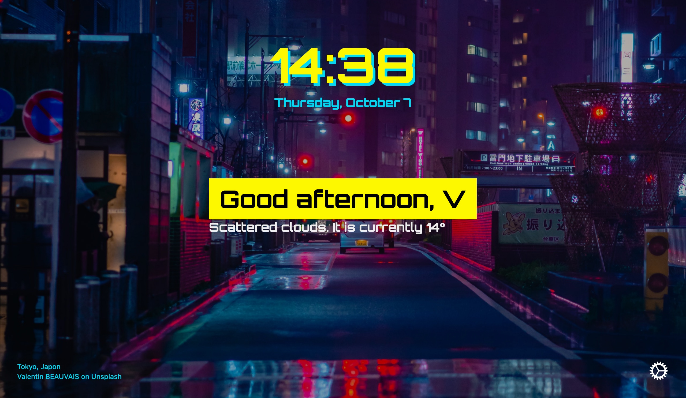
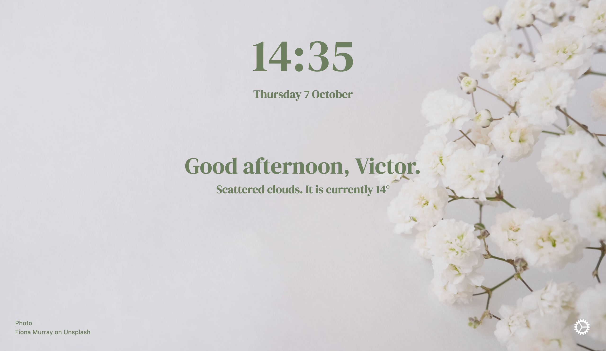

### Cyberpunk 2077



```json
{"background_blur":0,"background_bright":0.71,"clock":{"ampm":false,"analog":false,"face":"none","seconds":false,"timezone":"auto"},"css":"* #w_icon { display: none }\n* #date, #credit a { color: #00d8f3 }\n\n#interface #main {\n    align-items: flex-start\n}\n\n* #clock {\n    color: #fdf800;\n    text-shadow: 5px 5px #00d8f3\n}\n\n* #greetings, * #weather_desc {\n    text-shadow: none;\n    text-align: left;\n    background-color: #fdf800;\n    padding: 10px 20px;\n    color: black\n}","dark":"enable","dynamic":{"collection":"He87uFs-2zg","every":"tabs","time":0},"font":{"availWeights":["400","500","600","700","800","900"],"family":"Orbitron","size":"15","url":"https://fonts.googleapis.com/css?family=Orbitron:700","weight":"700"},"hide":[[0,0],[0,0,1],[0],[0]],"reviewPopup":1,"searchbar":false, "greeting":"V"}
```

### The Space Enthusiast

```json
{"background_blur":0,"background_bright":0.5,"background_type":"dynamic","clock":{"ampm":false,"analog":false,"seconds":true,"timezone":"auto"},"css":"/* Change weather text here */\n\n#interface #current::after {\n  content: ' on earth.'\n}\n\n/* the rest */\n\n#interface { color: #dfe1cc!important }\n#interface #time #date { margin-left: 50px }\n#interface #time {\n  flex-direction: row;\n  flex-wrap: wrap\n}\n\n#showSettings button img {\n  filter: sepia(1)\n}\n\n","cssHeight":280,"dark":"system","dynamic":{"every":"hour","collection":"858219,136301,235,s9aRSbDoSg8","time":0},"font":{"availWeights":["400","700"],"family":"Space Mono","size":"13","url":"https://fonts.googleapis.com/css?family=Space Mono:700","weight":"700"},"greeting":"Neil","hide":[[0,0],[0,0,1],[0],[0]],"searchbar":false,"showall":true,"usdate":true}
```

### Floral

```json
{"hide":[[0,0],[0,0,1],[0],[0]],"dynamic":{"every":"hour","time":0,"collection":"2AC1c6JsJh8","lastCollec":"user"},"cssHeight":220,"showall":true,"background_blur":0,"font":{"url":"https://fonts.googleapis.com/css?family=DM Serif Display:400","family":"DM Serif Display","availWeights":["400"],"weight":"400","size":"16"},"css":"#interface, #credit a {\n  color: #6d8161 !important;\n  text-shadow: none\n}\n\n#interface #date::before, #interface #weather::before { box-shadow: none }","dark":"disable","background_bright":0.9}
```

### Not Momentum

```json
{"background_blur":0,"background_bright":0.7,"background_type":"dynamic","clock":{"ampm":false,"analog":false,"face":"none","seconds":false,"timezone":"auto"},"css":"* #analogClock { margin-bottom: 1em }\n* #date { display: none }\n* #time { font-size: 2em }\n\n* #clock {\n   line-height: 1.1em\n}\n\n#interface { height: 80vh; padding-top: 10vh }\n#interface #time {justify-content: flex-end}\n#interface #main {justify-content: flex-start}\n\n","cssHeight":312,"dark":"enable","dynamic":{"collection":"","every":"day","lastCollec":"day","time":1629873600400},"font":{"availWeights":[],"family":"","url":"","weight":"600"},"greeting":"Victor.","hide":[[0,0],[0,1,0],[0],[1]],"reviewPopup":"removed","searchbar":false,"showall":true}
```

_Want your own custom profile here? [Contact us](/#further)!_
